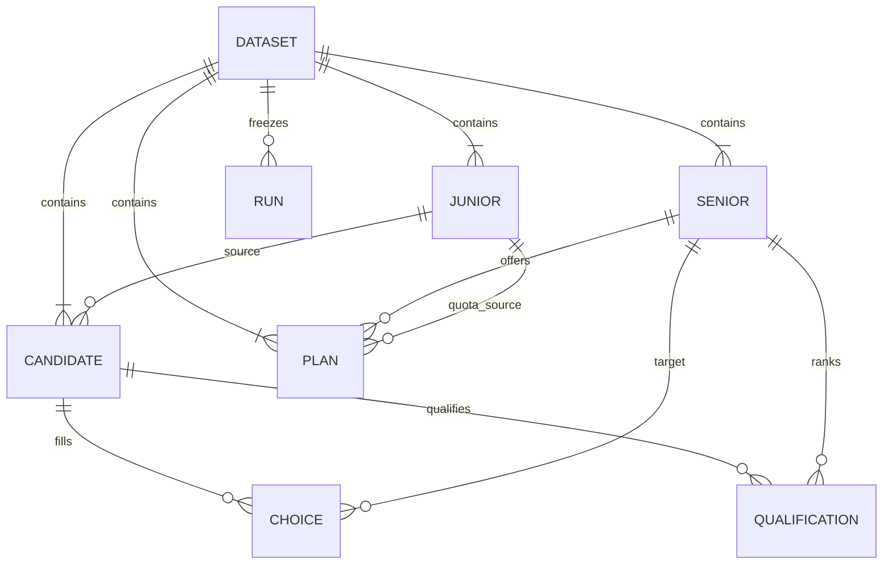
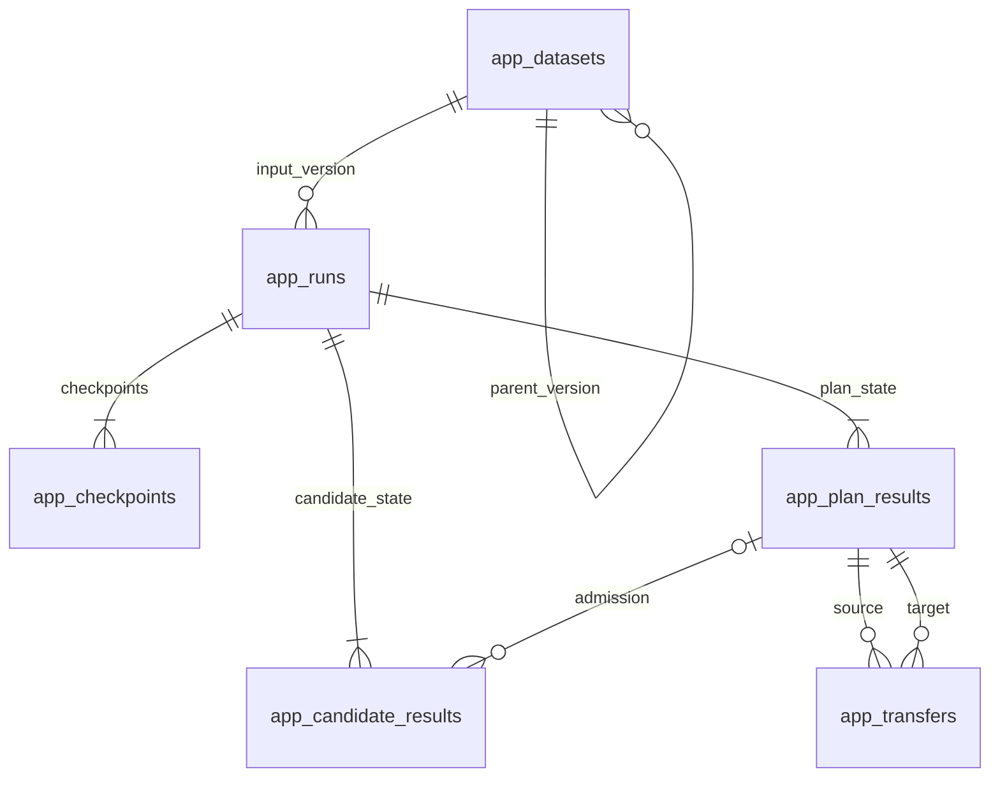
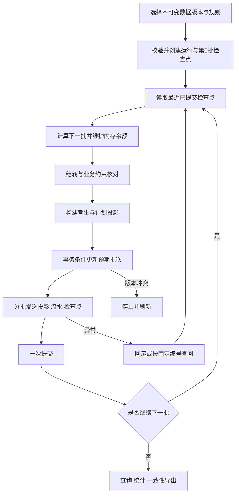

# 设计图表源稿

以下 Mermaid 为可编辑的逻辑说明。设计报告中的 PNG 由 tools/build_report.py 生成；database/schema_app.sql 是精确数据库结构。

## 逻辑输入关系

```mermaid
erDiagram
    DATASET ||--|{ JUNIOR : contains
    DATASET ||--|{ SENIOR : contains
    DATASET ||--|{ CANDIDATE : contains
    DATASET ||--|{ PLAN : contains
    JUNIOR ||--o{ CANDIDATE : source
    SENIOR ||--o{ PLAN : offers
    JUNIOR ||--o{ PLAN : quota_source
    CANDIDATE ||--o{ CHOICE : fills
    SENIOR ||--o{ CHOICE : target
    CANDIDATE ||--o{ QUALIFICATION : qualifies
    SENIOR ||--o{ QUALIFICATION : ranks
    DATASET ||--o{ RUN : freezes
```

quota_source 仅用于第二批；逻辑实体在主库不可变输入聚合中保存，在历史规模库有对应的六张关系表。

## 主系统物理关系

```mermaid
erDiagram
    app_datasets ||--o{ app_datasets : parent_version
    app_datasets ||--o{ app_runs : input_version
    app_runs ||--|{ app_checkpoints : checkpoints
    app_runs ||--|{ app_candidate_results : candidate_state
    app_runs ||--|{ app_plan_results : plan_state
    app_plan_results |o--o{ app_candidate_results : admission
    app_plan_results ||--o{ app_transfers : source
    app_plan_results ||--o{ app_transfers : target
```

## 执行流程

```mermaid
flowchart TD
    A[选择不可变数据版本与规则] --> B[校验并创建运行与第0批检查点]
    B --> C[读取最近已提交检查点]
    C --> D[计算下一批并维护内存余额]
    D --> E[结转与业务约束核对]
    E --> F[构建考生与计划投影]
    F --> G[事务条件更新预期批次]
    G --> H[分批发送投影 流水 检查点]
    H --> I[一次提交]
    I --> J{是否继续下一批}
    J -->|是| C
    J -->|否| K[查询 统计 一致性导出]
    G -->|版本冲突| L[停止并刷新]
    H -->|异常| M[回滚或按固定编号查回]
    M --> C
```
